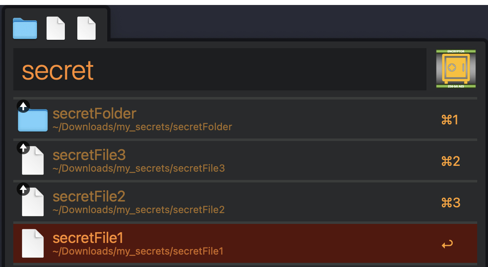
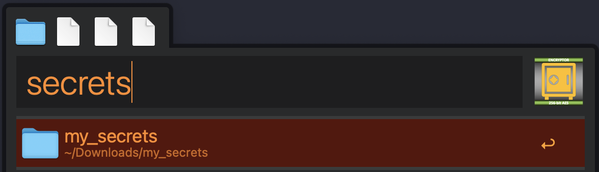
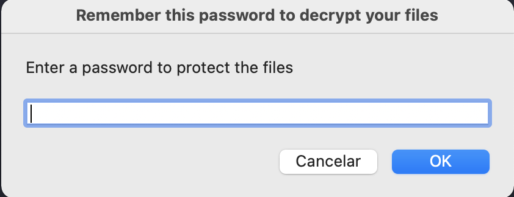
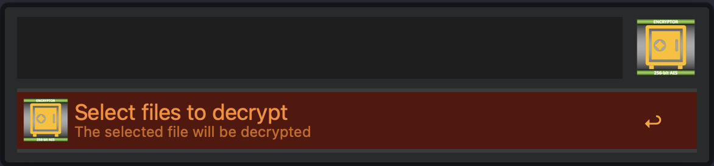
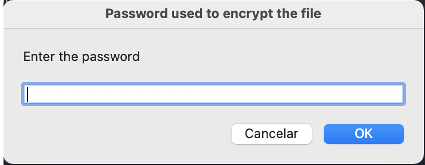

# Alfred Encryptor

Easily encrypt and decrypt files and folders with passwords using strong AES-256 ciphers.

# Usage

## Encrypting files/folders

To encrypt a file or folder type `enc` and select the files and/or folders you want to encrypt.  

> Tip: you can select multiple files/folders putting them on Alfred`s file buffer  

  

Next, select the destination folder.  
  

Inform the password to protect the encrypted file and its done!  
  

A file named `encryptor_*.enc` will be created and displayed in finder.  

Now you can safelly share this file knowing that only who has the correct password can open it!  

## Decrypting files encrypted with Encryptor

To decrypt a file encrypted by this workflow type `dec` and select the file to be decrypted.  
  

Next select the destination folder.  
  
Inform the password used to encrypt the file and its all that is needed!  
  

Alfred will open the destination folder on Finder and you can view the decrypted contents.  

# Requirements
This workflow require you to have `tar` and `openssl` avaliable on your system.  

To check if they're avaliable on your system open a terminal and type:  
```Shell
which tar openssl
```  

The expected result is similar to:  

```Shell
/usr/bin/tar
/usr/bin/openssl
```  

# Behind the scenes

To encrypt and decrypt files/folders this workflow uses tar and openssl commands in a bash terminal.  

Because of this, anyone who has openssl and tar installed on their systems can encrypt and decrypt files just like this workflow does.  

This means that you can send and receive encrypted files even with non Alfrerd users.  

To manually encrypt or decrypt files just follow the steps below.  

## Manually encrypt
Type the following comands on your terminal replacing:  
 - `FILE_N` and `FOLDER_N` with the files/folders you want to encrypt  
 - `PASSWORD` with the password to protect the file  
 - `FILENAME` with the name of the resulting file (keep the .enc extension)  

```Shell
tar -cvf /tmp/encryptor.tar FILE_1 FILE_2 FOLDER_1 FOLDER_2
openssl enc -aes-256-cbc -salt -in /tmp/encryptor.tar -k PASSWORD -out FILENAME.enc
rm -f /tmp/encryptor.tar
```  

## Manually decrypt
Type the following comands on your terminal replacing:  
 - `FILE` with the file to be decrypted  
 - `PASSWORD` with the password used to protect the file  
 - `FOLDER` with the folder where the decrypted files/folders should be placed  

```Shell
openssl enc -d -aes-256-cbc -in FILE -k PASSWORD -out /tmp/encryptor.tar
tar -xvf /tmp/encryptor.tar -C FOLDER
rm -f /tmp/encryptor.tar
```  

## Download
Check the [releases page](https://github.com/gohoyer/Alfred-Encryptor/releases) to download it.